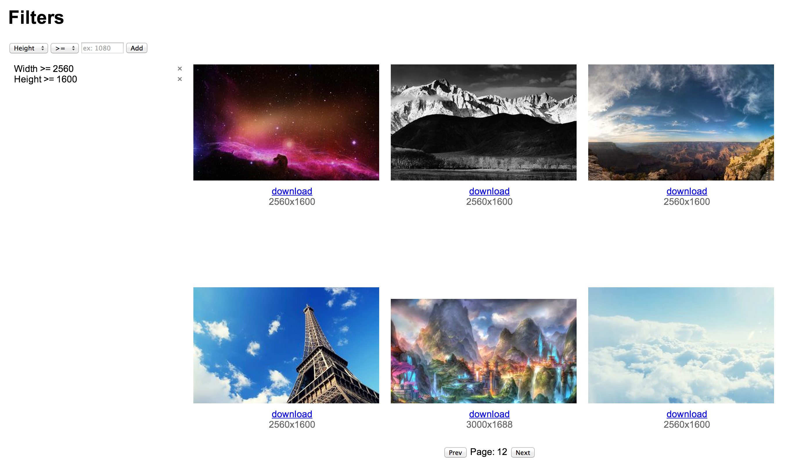

Imgur Album Browser
===================

This is a small experimental [React](http://facebook.github.io/react/) application that allows users to browse the contents of an Imgur album. It supports basic pagination and filtering the album by image width, height, and size in bytes.

Visit http://binarymuse.github.io/react-imgur-album-browser/ for a live demo.

The application uses [Mori](http://swannodette.github.io/mori/) for Clojure-style immutable, persistent data structures. Though performance is fine without it, the app also utilizes React's `shouldComponentUpdate` to skip updating components when the data they depend on hasn't change.

Currently the application is hard-coded to use [this Imgur gallery](http://imgur.com/gallery/abaz1). Please note that I do not own or manage the contents of the gallery, and thus cannot guarantee the appropriateness of the images contained within.
